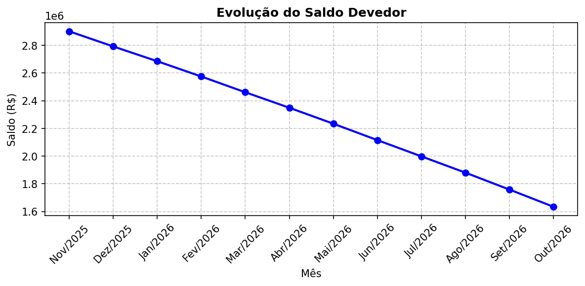
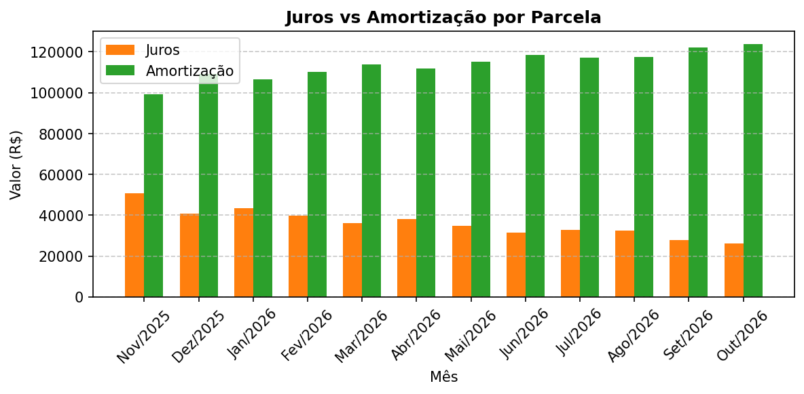
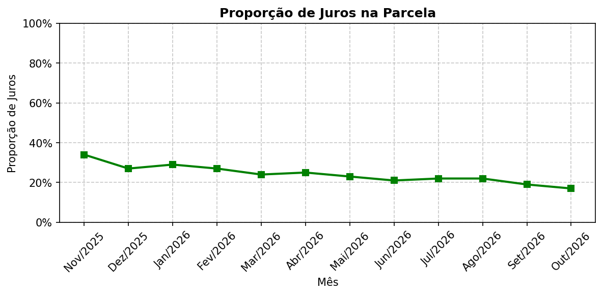
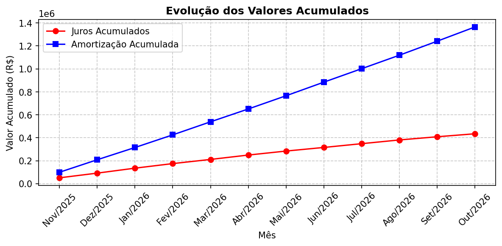

# CDI Cash Flow Simulator

> Sistema profissional para simulação de gestão de passivos financeiros com capitalização composta diária (Base 252), cálculo de juros acumulados e amortização de parcelas mensais. Gera relatórios interativos e exporta para Excel, PDF e Word.

## Demonstração da Interface e Gráficos

A aplicação exibe os seguintes gráficos dinâmicos (exemplos baseados na simulação padrão de 12 meses):

### Evolução do Saldo Devedor


### Composição das Parcelas (Juros vs Amortização)


### Proporção de Juros na Parcela


### Acumulado de Juros e Amortização


## Execução

### Local (sem Docker)

1. Instale o [uv](https://github.com/astral-sh/uv)
2. Clone o repositório e acesse a pasta
3. Execute:

```bash
uv sync
streamlit run app.py
```

### Com Docker
```bash
docker build -t financial-model .
docker run -p 8501:8501 financial-model

Acesse: http://localhost:8501

--ou--

docker compose up

Acesse: http://localhost:8501

--fechar--

docker compose down
```